# Hi, I'm Mohar // 夜のBuilder ⚡

  

## 🎮 Playful in tech, curious in AI/ML

- Building fun experiments, tools, and tiny automations
- Exploring LLM apps, RAG pipelines, and agent ideas
- Learning in public through side quests and prototypes

## 🧪 Current Experiments

- Autonomous eval loops for prompts and tools
- Efficient inference and observability in MLOps
- Hybrid retrieval with semantic + keyword search

## 🧠 Tech Stack

`Python` `TypeScript` `FastAPI` `PyTorch` `Docker` `Kubernetes` `Azure` `Postgres` `Redis`

## 📊 GitHub Signal

  
  

